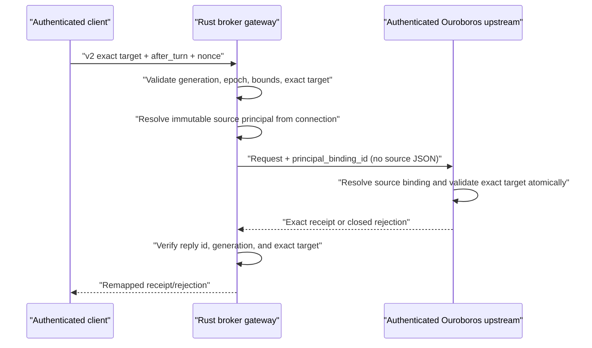

# RFC 0011: Exact-pane authenticated steering seam

- Status: Backend contract and fixture implemented; production activation blocked
- Date: 2026-08-17
- Parent: [RFC 0005](0005-authenticated-session-message.md)
- Terminal identity: [RFC 0006](0006-session-terminal-identity-bridge.md)

## Decision

Pane-specific steering is a separate, closed version-2 operation. It does not
widen RFC 0005's stable-session version-1 request and it does not authorize the
current UI. The exact target is:

```text
(session_id, execution_id, scope_id, attempt_id, generation)
```

The source never comes from this tuple or from caller JSON. The broker injects
only the `principal_binding_id` obtained from its authority registry. The
authenticated Ouroboros upstream resolves that binding to the exact source in
the same transaction that validates and admits the exact target.

```rust
#[serde(deny_unknown_fields)]
struct SessionMessageRequestV2 {
    version: Version2, // exactly 2
    id: NonZeroU64,
    op: ResolveAndAdmitExactV2,
    broker_generation: NonZeroU64,
    authority_epoch: u64,
    request_nonce: Nonce,
    target: ExactSessionIdentity,
    mode: SessionMessageMode, // after_turn only
    message: BoundedMessage,
    reason: BoundedReason,
    expires_at: Timestamp,
    correlation_id: Option<BoundedId>,
}
```

The operation string is
`session_message_resolve_and_admit_exact`. A zero target generation, unknown
outer or target field, source-shaped field, unsupported mode, stale broker
generation, or stale authority epoch fails closed before dispatch.

The private capability name for eventual negotiation is:

```text
session.message.resolve_admit_exact.v2
```

It is not currently advertised.

## Why version 1 is unchanged

Version 1 deliberately supplies a stable `target_session_id` with optional
execution and generation guards so Ouroboros can resolve the active target
inside its transaction. Two fanout panes can share all three values while
differing only by scope and attempt. Using version 1 for a clicked pane could
therefore steer a sibling or return ambiguity.

Adding scope and attempt fields directly to version 1 would silently change a
published closed contract. Version 2 gives exact-pane callers an unambiguous
selector while old clients and upstreams continue to reject the unknown
operation.

## Backend flow



For a receipt, the broker verifies that the upstream target tuple equals the
requested version-2 target. A sibling-pane receipt is a protocol violation and
becomes outcome-unknown; it is never shown as a successful send. Explicit
upstream rejections remain rejections. A `delivery_uncertain` receipt preserves
the original nonce and states that application was not proven.

The receipt source is also checked against registry authority. A session
principal must return the same session, execution, scope, and attempt (source
generation is resolved by Ouroboros's active-attempt guard); a desktop
principal must return a user source with the same authority epoch. A provider
cannot switch either side of the message in its receipt.

The version-2 request digest uses the domain
`ourocode.session-message.exact-target.request-digest.v2` and includes the
registry-derived source principal, exact target tuple, `after_turn`, bounded
payload digests, expiry, derived causal context, and correlation ID. Transport
request ID and broker generation are excluded so an exact retry can preserve
idempotency across reconnect metadata, matching RFC 0005.

The frozen cross-language vector is
[session-message-exact-target-v2-known-vector.json](fixtures/session-message-exact-target-v2-known-vector.json).

## Production boundary remains fail-closed

`main_v4_ghostty` validates two inherited descriptors but intentionally does
not start or advertise `SessionMessageGateway`. Descriptor possession proves
neither installation authority nor Ouroboros service identity. Production is
still missing the launchd/XPC-owned composite lifecycle, reciprocal service
verification, durable principal-registration ACK activation, and revocation
coordination listed in RFC 0005.

The managed loopback MCP path in `OuroborosMCPClient.steer` is separate. Its
bearer token authenticates the shared HTTP service contract, but that path does
not traverse the Rust authority registry or inherited-FD gateway. It currently
calls the legacy `ouroboros_session_signal` tool and supplies `source=user`.
It must not be described as broker-authenticated session-to-session messaging,
must not enable the version-2 capability, and must not be used as fallback
after a gateway failure.

Likewise, `SessionMessageGatewayClientV1` can decode and verify an optional
broker hello descriptor, but production emits none. This RFC adds no hello
field, no capability toggle, and no UI send-path activation.

## Fixture evidence

The Rust socket fixture creates an authenticated session binding only through
the existing verified-service and durable-ACK test capabilities. It then sends
real length-prefixed frames over both client and upstream UNIX socketpairs and
proves:

1. pane B is queued with the exact target receipt and the source tuple resolved
   from `binding-1`;
2. pane A, despite sharing session, execution, and generation with pane B, is
   explicitly rejected rather than redirected;
3. a `delivery_uncertain` receipt remains non-applied and keeps its nonce;
4. an upstream receipt for pane A in response to a pane-B request is rejected
   by the broker codec.

This is backend transport evidence, not a fake provider and not production
authority. Shipping remains blocked until the real Ouroboros private endpoint
implements the operation and the composite runtime satisfies RFC 0005.
